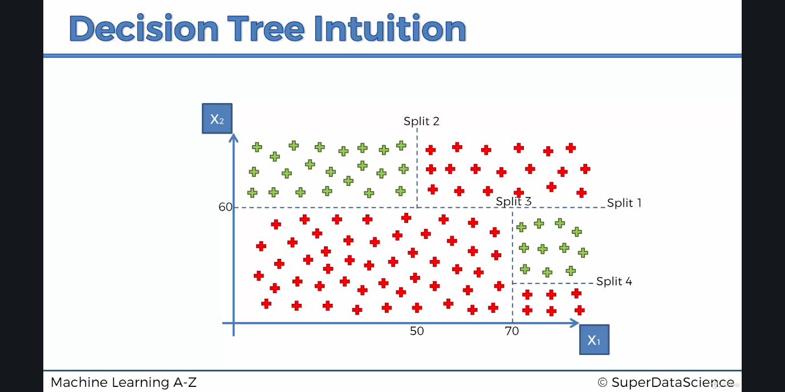

# Decision Trees
- Widely used for classification problems
- It breaks down the data by making decisions based on multiple "questions" at each level.
- Splits are performed to optimize the number of groups in which each category can be in. Figure to illustrate this: 
- They are vulnerable to overfitting as the algorithm keeps splitting nodes into sub-nodes until each nodes becomes homogeneous.
- Decision Trees are quite outdated, but is still used in more sophisticated algorithms like Random Forest.