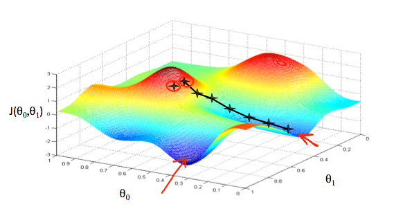

# Regression Problems

When we try to predict results within a continous output. We are basically trying to map input variables to output variables with the help of a continous function called the hypothesis. To measure the accuarcy of the hypothesis we use a cost function. An example of a cost function is the "squared error function" which basically takes the hyptohesis value and differenciate it with the actual value and squares it. 

To find the best coefficients of the hypothesis which also results in a (possible minimum) value in the cost function, we use gradient descent. Gradient descent is a optimization algorithm that finds the coefficients that results in a minimum value for the cost function. This also then (often) gives us the best hypothesis function.

Picture to illustrate procedure of gradient decent

