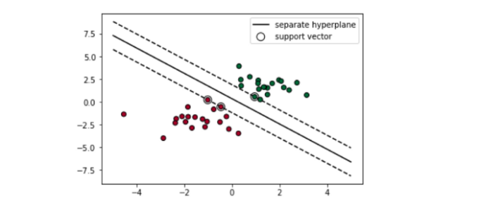

# Support Vector Machines
- An algorithm that looks for an optimal line with the constraints of correctly classifying either class (binary).
- Hyperplane is often regarded as the "seperator" between the data clusters. It is always an n-1 dimensional subspace of a n dimension space. If we are in R^2, the hyperplane will be a line in R^1.
- Out of all datapoints, we look for our support vectors. These will help us define a margain which will define out hyperplane. 
- SVM has turned out to be very good for text classifications, but main problem is that it is a binary classification algorithm
- However, this is easy to solve with the extension of either one vs one or one vs all.
- Often data is not as nicely distributed, leading to non-separable cases where our hyperplane wont cover 100 % of the cases ( some cases are registred as true negative).
- This can be solved with either Soft Margin or Kernel Tricks.

How SVM can look like in a 2D room.

