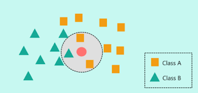

# K- nearest-neighbours
- Very simple algorithm which generally supports more than 2 classes (binary) naturally.
- It basically takes the euclidean distance between k nearest neighbours and looks up which has the most closest neighbours. 
- The algorithm becomes significantly slower when the dataset becomes larger.
- If the data can be seperated without a lot of mixture, the results are significantly good.
- For example, if we have 2 categories, GUI and Network, the data on a R^2 plane can look similar to this:

Where the red circle is the data which should be determined as either a square or a triangle. The value of k = 3, and the number of squares are 2 and triangles are 1. Thus the circle will be identified as a squared.
